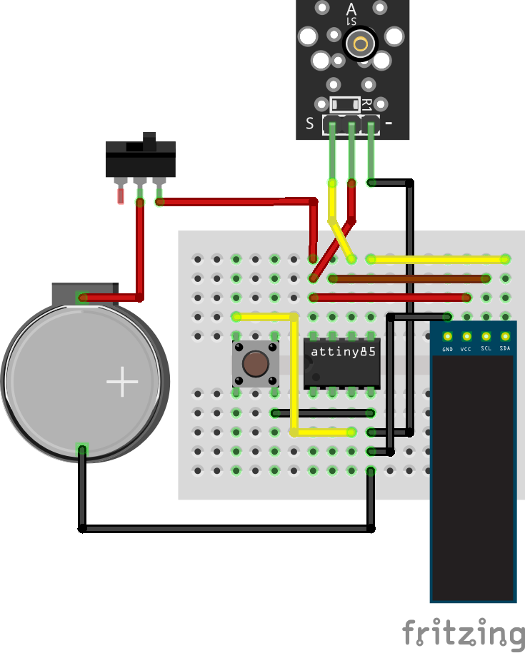

# Attiny85 pedometer

An ATtiny85 step counter equipped with a ky-002 vibration sensor, featuring a switch button to initiate counting and a push button to display the number of steps and walked distance on the OLED screen.

